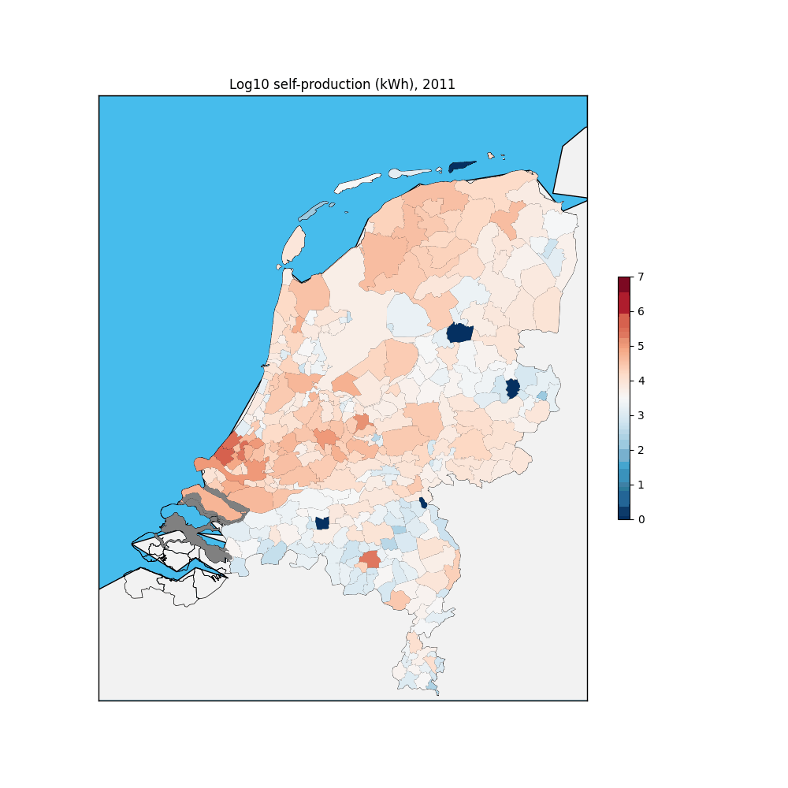

(page_topic1)=
Week 1
=======================

Deze week beginnen we met een introductie. De powerpoint is [hier](../../files/stuurinformatie_workshop_1_introductie.pptx) te vinden. In de komende workshops gaan jullie leren werken met een groot dataset en hoe je deze kunt analyseren met behulp van Python! Hieronder is een GIF te zien met een deel van het eindresultaat.



## Benodigdheden
- [De powerpoint](../../files/stuurinformatie_workshop_1_introductie.pptx)
- [Het Excel bestand](../../files/intro_file_stuurinfo_week_1.xlsx)
- Een laptop of vaste computer

## De opdracht
De opdracht voor deze week is te vinden in het menu onder [Opdracht](https://remi-ui.github.io/python_tb/class/week01/Python_basis.html).

```{warning}
Deze opdracht, alsook de opdrachten van week 2, 3, 4 en 5, voer je individueel uit.
```
## Deadline

De deadline voor opdracht 2 is de donderdagavond (23.59) de week na deze workshop.
